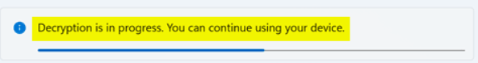
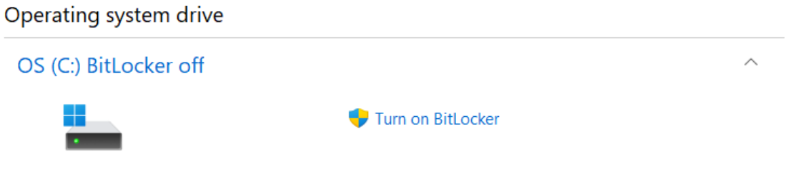
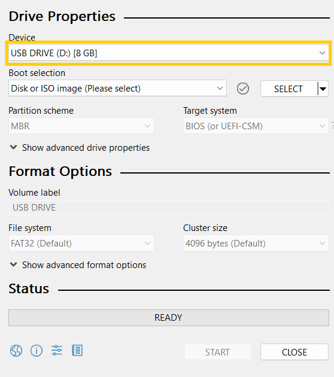
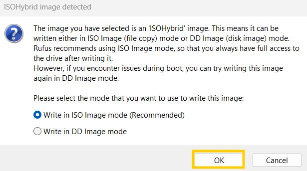
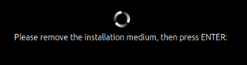

<h3><strong>Required Items:</strong></h3>

- A USB flash drive with at least 4 GB of storage (note: this drive will be erased, so back up any important data).
- A laptop or computer running Windows 11.

<h3><strong>Summary</strong></h3>

Dual booting allows you to install another operating system alongside your existing one, such as adding Ubuntu to your Windows 11 device. This gives you access to both systems without erasing your current operating system—provided it's done correctly.

This guide is tailored for Windows 11 and won't work on macOS due to different compatibility issues and security features on MacBooks. If you want to dual boot on a MacBook, I can help with that separately.

Although I've never experienced data loss from dual booting, it's always good practice to back up your data on an external hard drive.

[Backing up to an external hard drive (optional)](https://www.microsoft.com/en-us/windows/learning-center/back-up-files)

<h3><strong>Turning off Secure Boot and Fast Boot</strong></h3>

While Secure Boot and Fast Boot may not prevent Ubuntu from installing on all devices, it may for some of them. Therefore, it is advised to disable both of them to prevent any issues during the dual booting process.

To disable Secure Boot and Fast Boot, you will need to go into the BIOS settings of your device. The BIOS for each device can vary, so this will not be a universal guide and you may have to search up details about your device online to help you find the exact menus.

**If your device does not have Secure Boot or Fast Boot, then you will not need to change anything and can continue with the guide.**

1. Restart your device.
2. When your device is starting to turn on, repeatedly press the key for your device's brand. Commonly used keys are:

- Acer: F2 or DEL
- ASUS: F2 or DEL
- Dell: F2 or F12
- HP: ESC or F10
- Lenovo: F2 or Fn + F2
- MSI: DEL

3. Use the arrow keys to navigate the BIOS menu and search for the options for "Secure Boot" and "Fast Boot." "Secure Boot" may be under the sections labelled such as "System Configuration" or "Boot," while "Fast Boot" could either be under the "Advanced" section or be in the same section as "Secure Boot." If you do not see the options anywhere, your device doesn't have them.

4. Highlight the "Secure Boot" or "Fast Boot" option and press "Enter" if it is already enabled by default in order to disable it. If the option to highlight "Enabled" or "Disabled" pops up, highlight "Disabled" and press "Enter." 

5. Navigate to the "Exit" section and make sure to save your changes before leaving the BIOS menu.

<h3><strong>Turning off BitLocker/Device Encryption</strong></h3>

Most Windows 11 devices have BitLocker enabled, but not all. If you can't find "Device Encryption" or "Manage BitLocker" in your search, your device likely doesn't have it.

**Note: Different Windows 11 versions may list encryption settings under "Device Encryption" or "BitLocker." Try both if needed.**

<h4><strong>Turn off Device Encryption</strong></h4>

<ol>
<li>Use the Windows search bar to search "Device encryption settings" and select "Open."</li>
</ol>

  

<ol start="2">
<li>Select the option to "Off"</li>
</ol>

  

<ol start="2">
<li>Press "Turn off" to confirm.</li>
</ol>

  

<ol start="4">
<li>Wait for the decryption process to complete.</li>
</ol>

  

<h4><strong>Turn off BitLocker</strong></h4>

<ol>
<li>Search for "Manage BitLocker" in the Windows search bar and click "Open."</li>
</ol>

  

<ol start="2">
<li>Click "Turn off BitLocker" under the "Operating system drive" section.</li>
</ol>

  

<ol start="3">
<li>Wait for the drive to finish decrypting (it will take a while), it will look like this once it's finished.</li>
</ol>

  

<h3><strong>Creating a Bootable USB Flash Drive</strong></h3>

Rufus is a tool that converts your USB flash drive into a bootable drive with an operating system. After installing Ubuntu from the USB, you won’t need the drive plugged in to use Ubuntu.

<ol>
<li><a href="https://releases.ubuntu.com/jammy/ubuntu-22.04.4-desktop-amd64.iso" target="_blank">Install Ubuntu 22.04 ISO here.</a></li>
<li><a href="https://github.com/pbatard/rufus/releases/download/v4.5/rufus-4.5.exe" target="_blank">Install Rufus here.</a></li>
<li>Search for "rufus-4.5.exe" using the Windows search bar and select "Run as administrator."</li>
</ol>

  

 
<ol start="4">
<li>Click "Yes" to allow Rufus to make changes to your device.</li>
<li>In Rufus, select your USB flash drive from the "Device" dropdown. The drive might be labeled differently than "USB DRIVE (D:)."</li>
</ol>

  

<ol start="6">
<li>Click the "SELECT" button under "Boot selection."</li>
</ol>

  

<ol start="7">
<li>Locate and select the "ubuntu-22.04.4-desktop-amd64" file in your Downloads folder, then click "Open."</li>
</ol>

  

<ol start="8">
<li>Ensure the correct drive and file are selected, then click "START."</li>
</ol>

  

<ol start="9">
<li>Confirm by pressing "OK" for ISO Image mode.</li>
</ol>

  

<ol start="10">
<li>Click "OK" to erase the USB flash drive. If you have important data on it, cancel and choose a different drive.</li>
</ol>

  

<ol start="11">
<li>If you see this pop-up, click "OK."</li>
</ol>

  

<ol start="12">
<li>Wait for Rufus to finish creating the bootable USB drive.</li>
</ol>

<h3><strong>Installing Ubuntu 22.04</strong></h3>

<ol>
<li>Plug in the USB drive you just created.</li>
<li>Search for "Change advanced startup options" in the Windows search bar and click "Open."</li>
</ol>

  

 
<ol start="3">
<li>Click "Restart now" under "Advanced startup."</li>
</ol>

  

<ol start="4">
<li>Once in the advanced startup menu, choose "Use a device." You can use your mouse or arrow keys + "Enter."</li>
</ol>

  

<ol start="5">
<li>Select your USB flash drive from the list. It might be labeled differently than "Linpus lite."</li>
</ol>

  

<ol start="6">
<li>Press Enter with "Ubuntu" highlighted in the menu.</li>
</ol>

  

<ol start="7">
<li>Choose "Install Ubuntu."</li>
</ol>

  

<ol start="8">
<li>Continue with the default settings on the next few pages.</li>
<li>When prompted, select your Wi-Fi network and enter the password.</li>
<li>Ensure "Install Ubuntu alongside Windows Boot Manager" is selected, then click "Continue."</li>
</ol>

  

<ol start="11">
<li>Drag the divider to allocate space for Ubuntu. I recommend at least a quarter of your hard drive space. Then, click "Install Now."</li>
</ol>

  

<ol start="12">
<li>Press "Continue" to confirm.</li>
</ol>

  

<ol start="13">
<li>Choose your time zone (Chicago) and click "Continue."</li>
<li>Enter your desired username and password, then click "Continue."</li>
<li>Wait for Ubuntu to install, then click "Restart Now."</li>
<li>Remove the USB flash drive when prompted and press "Enter."</li>
</ol>

  

 
<ol start="17">
<li>After restarting, the GRUB menu will appear each time you start your device. Use the arrow keys + "Enter" to choose which operating system to boot.</li>
</ol>

  

<ol start="18">
<li>Congratulations! You've successfully dual-booted your device. I recommend following the <a href="https://docs.ros.org/en/humble/Installation/Ubuntu-Install-Debians.html" target="_blank">ROS 2 Humble installation guide</a> next. This installation will be done on Ubuntu, so boot into Ubuntu first. Copy and paste the commands in the terminal (shortcut to open is Ctrl + Alt + T) one line at a time.</li>
</ol>
